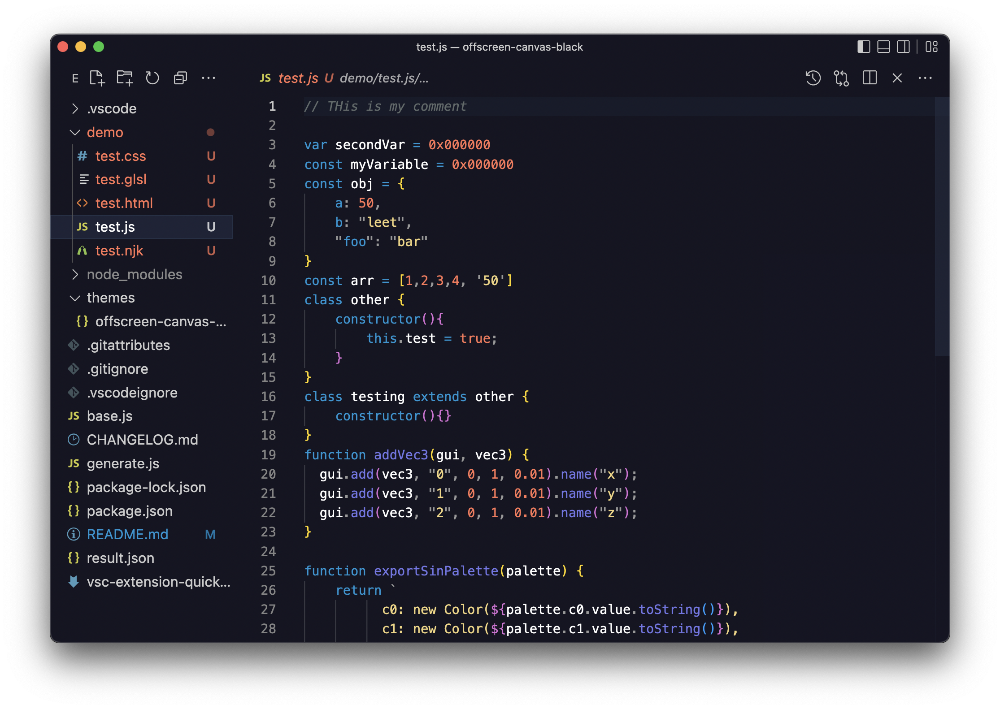
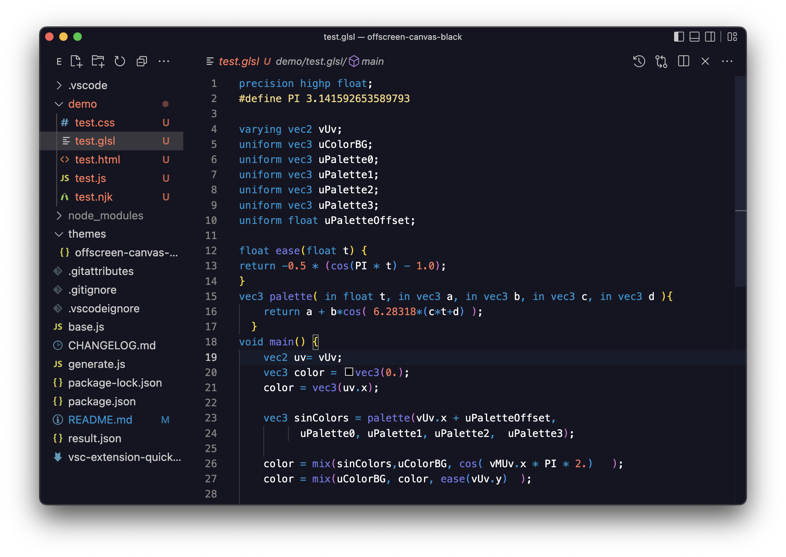

# Offscreen Black

A Visual Studio Code theme for creative developers. Made for the black color palette in [offscreencanvas.com](https://offscreencanvas.com/). Heavily inspired by my previous theme: [Sarah Drasner's Night owl](https://github.com/sdras/night-owl-vscode-theme).

# Instalation 
1. Install Visual Studio Code.
2. Open the Extensions menu.
3. Search and install Offscreen Black
4. Reload vscode
5. Code > Preferences > Color Theme > Night Owl

## Javascript

## GLSL

# Other Offscreen Palettes

- Pink -> Coming Soon
- Blue -> Coming Soon
- Aquamarine -> Coming Soon
- Dark Blue -> Coming Soon
- Grey -> Coming Soon
- White -> Coming Soon
- Orange -> Coming Soon

